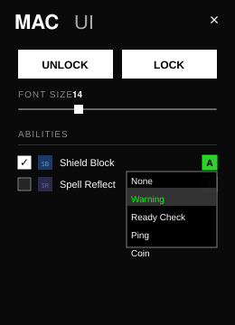
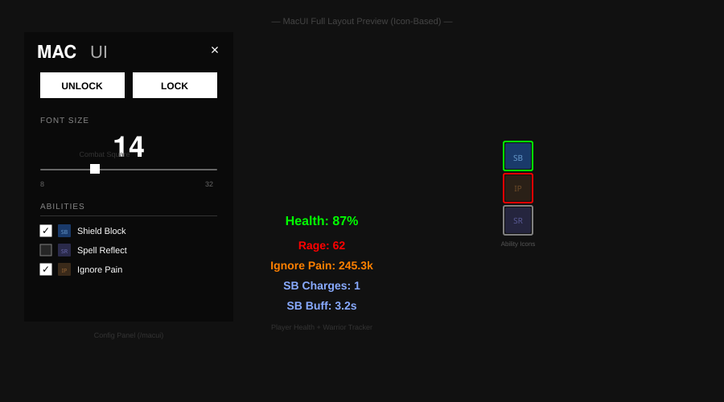

# MacUI

A sleek, lightweight, and highly optimized custom user interface for World of Warcraft (Midnight 12.0.5+ API compliant). Designed for power users who want a brutalist, distraction-free combat tracking system with zero external dependencies.

## Features

### Dynamic Ability Tracker
A modular, class and spec-aware tracking system. Tracks abilities using real spell icons with a built-in state machine:
- 🟢 **Green Border:** Ability/Buff is currently active on you.
- 🔴 **Red Border (Desaturated Icon):** Mitigation missing while in combat!
- ⚪ **Gray Border:** Out of combat / Neutral state.

### Brutalist Configuration Menu
Type `/macui` to open a minimalist, brutalist UI panel where you can lock/unlock frames, scale text sizes, and dynamically select which abilities to track.
- **Smart Input Box:** Track *any* ability in the game. Simply click the input box and **Shift-Click** a spell from your spellbook, or type an exact Spell ID. MacUI handles the rest dynamically.
- **Audio Alarm Dropdown:** Click the `[A]` button next to any tracked ability to open a custom dropdown. Assign sounds like "Raid Warning", "Ready Check Ping", or "Coin Drop". If you are in combat and missing that buff, the addon will pulse the alarm exactly once every 3 seconds to save your life.

### Class Modules
- **Warrior Module**: Tracks Rage, Ignore Pain absorbs, and Shield Block charges/duration.
- **Paladin Module**: Tracks Holy Power, Shield of the Righteous duration, and active Consecration.
- **Extreme Efficiency**: All trackers utilize `OnUpdate` throttling, caching, and dynamic script detachment to ensure 0 CPU waste.

### Persistent Layouts
Move any UI element on your screen and lock it. Your exact layout coordinates, tracked abilities, and audio alarm settings are automatically saved to your `SavedVariables` across game sessions.

---

## Previews

### Live Combat Simulation

*A live simulation of the MacUI state machine reacting to entering combat, taking damage, applying a buff, and triggering an audio alarm.*

### Brutalist Config & Smart Input

*The updated `/macui` config panel featuring a compressed font scale slider, dynamic ability selection, the custom Audio Dropdown menu, and the Smart Input Box at the bottom.*

### Full Layout Overview

*The complete layout, featuring the configuration panel (left), center resource trackers, and the icon-based ability indicators on the right.*

---

## Installation
1. Download or clone this repository.
2. Place the `MacUI` folder inside your `World of Warcraft/_retail_/Interface/AddOns/` directory.
3. Log into the game and ensure the addon is enabled in your character select screen.
4. Type `/macui` in chat to begin customizing your UI!