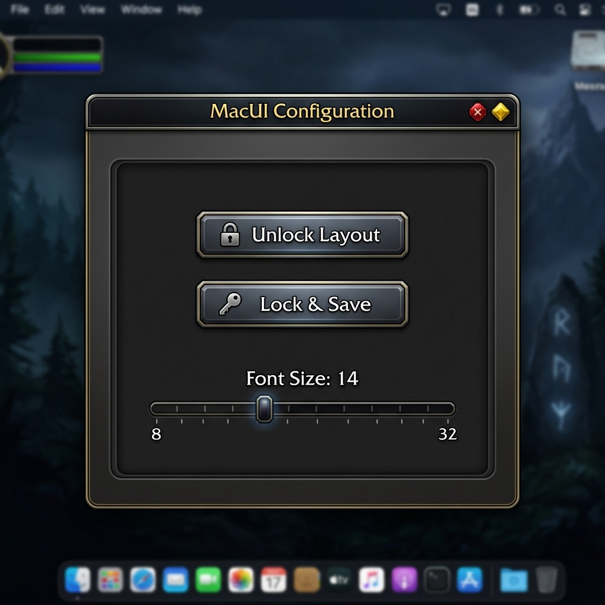
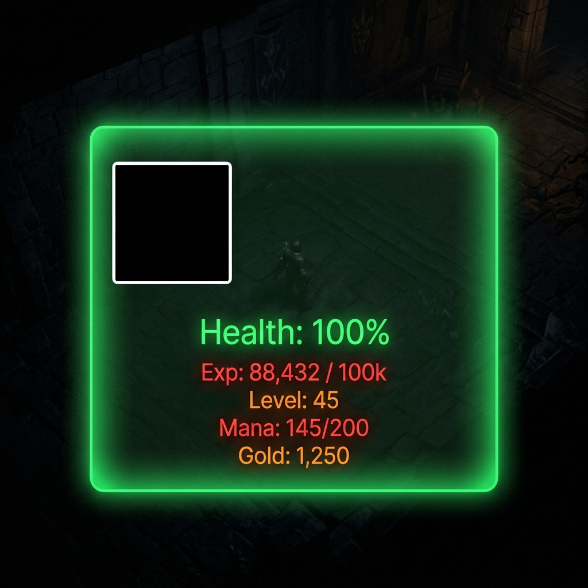

# MacUI

A sleek, lightweight, and highly optimized custom user interface for World of Warcraft (Midnight 12.0.5+ API compliant).

## Features
- **Zero External Dependencies**: Built entirely using pure Vanilla WoW API templates. No need to download heavy libraries like Ace3.
- **In-Game Configuration Menu**: Type `/macui` to open a native-feeling UI panel where you can lock/unlock frames and globally scale your text sizes.
- **Persistent Layouts**: Move any UI element on your screen and lock it. Your exact layout coordinates are automatically saved to your `SavedVariables` across game sessions.
- **Player Health Tracker**: A clean, universally available player health tracker that updates instantly and displays as a percentage.
- **Warrior Tracker Module**: A class-specific module that tracks Rage, Ignore Pain absorbs, and Shield Block charges/duration with extreme efficiency and frame throttling.

## Previews

### In-Game Options Menu

### Unlocked Layout Mode

## Installation
1. Download or clone this repository.
2. Place the `MacUI` folder inside your `World of Warcraft/_retail_/Interface/AddOns/` directory.
3. Log into the game and ensure the addon is enabled in your character select screen.
4. Type `/macui` in chat to begin customizing your UI!