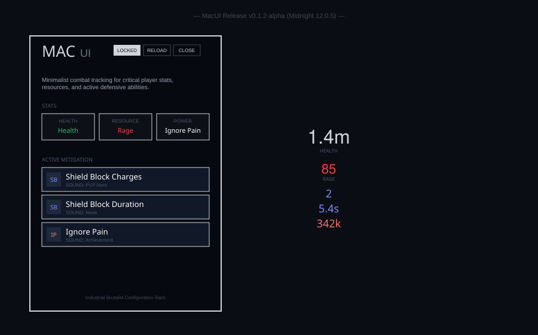

# MacUI (v0.1.2-alpha)

A high-performance, **Industrial Brutalist** user interface for World of Warcraft (Midnight 12.0.5+). MacUI provides a typography-driven combat HUD with zero external dependencies, focused on raw information hierarchy and vertical rhythm.

## Design Philosophy

- **Brutalist Minimalism**: High-contrast typography on solid black backgrounds. No decorative fluff.
## Latest Release (v0.1.2-alpha)

### ⚔️ Granular Combat Tracking
- **Shield Block Split**: Separated tracking for **Charges** and **Buff Duration** in the config.
- **12.0.5 Compatibility**: Fixed baseline ability detection (Last Stand, Shield Wall, Ardent Defender) for the Midnight expansion.

### 📐 Brutalist Configuration Rack
- **Modular Stat Tiles**: High-contrast, card-based toggles for Health, Resource, and Power tracking.
- **System Micro-bar**: Integrated `LOCKED`, `RELOAD`, and `CLOSE` cluster for quick UI management.
- **State-Aware Logic**: Contextual descriptions and checklists that persist across player sessions.

### 📊 Spec-Aware HUD
- **Dynamic Context**: Contextual stat tiles (Health, Rage, Holy Power) that adapt to your class and specialization.
- **Taint-Free Rendering**: Direct-to-engine Secure Frame values for high-performance combat feedback.
- **Audio Alerts**: Curated sound library for critical missing buffs.

## Architecture

```
MacUI/
├── MacUI.lua            # Core registry & initialization
├── Config.lua           # Modular Brutalist options panel
├── PlayerStats.lua      # Secure Health, Resource, and Power tracking
├── ClassMechanics.lua   # Active Mitigation & Duration engine (Pooled)
├── AbilityTracker.lua   # Defensive cooldown indicator rack (Pooled)
└── MinimapButton.lua    # Modern Compartment & legacy minimap integration
```

## Preview (v0.1.2)


*MacUI follows a strict industrial grid for perfect visual alignment.*

## Installation

1. Place `MacUI` in `_retail_/Interface/AddOns/`.
2. Use `/macui` or the minimap icon to open the panel.
3. **Shift-Click** spells from your spellbook into the input box to add custom tracking.
4. **Developers**: Use `./build_release.sh` to generate a clean, production-ready `MacUI` folder in the parent `release/` directory.

## License
[MIT](LICENSE)