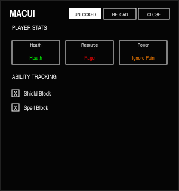

# MacUI

A high-performance, ultra-compact user interface for World of Warcraft (Midnight 12.0.5+ API compliant). Designed with a **Brutalist** aesthetic, MacUI provides a distraction-free, typography-driven combat dashboard with zero external dependencies.

## Design Philosophy

MacUI is built on the principles of **Minimalism** and **Vertical Rhythm**:
- **Pure White Contrast**: High-contrast pure white typography on a solid black background.
- **Rhythmic Spacing**: Every element is aligned to a strict vertical rhythm (24px section gaps, 12px content gaps).
- **Brutalist Hierarchy**: Information is presented with raw honesty—bold labels, sharp borders, and zero decorative fluff.

## Key Features

### 📐 Ultra-Compact Configuration
Access your settings via `/macui` or the custom minimap button. The config panel has been refined for maximum efficiency:
- **Pro Header**: `LOCKED`, `RELOAD`, and `CLOSE` actions are integrated into a single top-right micro-bar.
- **Binary Status**: A single, state-aware button toggles between `[ UNLOCKED ]` (Inverted for editing) and `LOCKED` (Standard for combat).
- **Checklist Tracking**: Use the intuitive `[X]` checklist to toggle custom spell tracking.

### 📊 Spec-Aware Player Stats
Real-time tracking of your most critical metrics, optimized for the 12.0.5 API:
- **Shorthand Formatting**: Large values (like Health or Ignore Pain) are automatically formatted to `k` and `m` shorthand (e.g., `1.2m`, `450k`) for instant readability.
- **Dynamic Hierarchy**: Stat cards display the category (Health, Resource, Power) at the top and the specific spec name (Health, Rage, Ignore Pain) at the bottom.
- **Color-Coded Values**: Stat values use spec-appropriate colors (Green, Red, Orange, Blue) for clear visual distinction without cluttering the UI.

### ⚔️ Specialized Protection Modules
Deeply integrated support for Protection Warriors and Paladins:
- **Ignore Pain Tracking**: Secure, aura-based absorb tracking that avoids "Secret Number" taint errors.
- **Shield Block Integration**: Independent tracking of Shield Block charges and active buff durations.
- **Holy Power & SotR**: Minimalist tracking for Protection Paladin resources.

### 🗺️ Minimap & Branding
- **Brutalist "M" Icon**: A custom, flipped-W logo for the minimap.
- **Independent Layout**: Every stat readout and ability icon is an independent frame. Unlock to drag them anywhere; Lock to save them forever.

## Architecture

```
MacUI/
├── MacUI.lua              # Core registry, FormatNumber helper, Spec change logic
├── Config.lua             # Ultra-compact options panel & UI layout
├── PlayerStats.lua        # Health, Resource, and Power (Ignore Pain) tracking
├── ClassMechanics.lua     # Class-specific aura tracking (Shield Block, etc.)
├── AbilityTracker.lua     # Draggable custom spell icons with state machine
├── Animations.lua         # PulseRed and Fade effects
├── Square.lua             # Minimalist Shield Block status indicator
└── MinimapButton.lua      # Custom "M" icon & AddonCompartment integration
```

## Technical Details
- **Zero Dependencies**: No Ace3, no LibDataBroker.
- **12.0.5 Compliant**: Uses modern `C_Spell` and `C_UnitAuras` table returns.
- **Taint-Aware**: Uses safe number formatting to avoid protected value restrictions in combat.
- **Performance**: Throttled `OnUpdate` handlers and upvalued globals for maximum FPS.

## Previews

### Final Compact UI

*The final ultra-compact layout featuring the header-integrated lock toggle and slim stat cards.*

### Spacing & Rhythm Analysis

*MacUI follows a strict 24px/12px vertical rhythm for a professional, "locked-in" feel.*

## Installation
1. Place the `MacUI` folder in `_retail_/Interface/AddOns/`.
2. Type `/macui` or click the minimap icon to open the panel.
3. **Shift-Click** any spell from your spellbook into the input box to track it.

## License
See [LICENSE](LICENSE) for details.