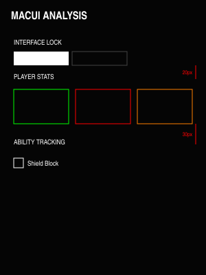

# MacUI

A high-performance, **Industrial Brutalist** user interface for World of Warcraft (Midnight 12.0.5+). MacUI provides a typography-driven combat HUD with zero external dependencies, focused on raw information hierarchy and vertical rhythm.

## Design Philosophy

- **Brutalist Minimalism**: High-contrast typography on solid black backgrounds. No decorative fluff.
- **Vertical Rhythm**: Unified spacing grid (24px/12px) for a "locked-in" industrial feel.
- **Zero-Waste Engineering**: Optimized for the 12.0.5 "Secret Number" API and high-frame-rate combat.

## Key Features

### 📐 Modular "Rack" Configuration
- **System Micro-bar**: Integrated `LOCK`, `RELOAD`, and `CLOSE` cluster.
- **State-Aware Toggles**: Intuitive checklists and binary status buttons.
- **Unified Logic**: One-click configuration that persists across sessions.

### 📊 Spec-Aware HUD
- **Taint-Free Stats**: Direct-to-engine rendering for Health and Resource values (12.0.5 compliant).
- **Smart Shorthand**: Auto-formatting for large values (e.g., `1.2m`, `450k`).
- **Dynamic Context**: Contextual stat tiles (Health, Rage, Holy Power) that adapt to your class and specialization.

### ⚔️ Pro Combat Tracking
- **Duration Timers**: Precision text tracking for Active Mitigations (Shield Block, SotR, Consecration).
- **Defensive Rack**: Sharp, square icons for major cooldowns with neon status borders.
- **Audio Alerts**: Curated sound library for critical missing buffs.

## Architecture

```
MacUI/
├── MacUI.lua            # Core registry & initialization
├── Config.lua           # Modular Brutalist options panel
├── PlayerStats.lua      # Secure Health, Resource, and Power tracking
├── ClassMechanics.lua   # Active Mitigation & Duration engine (Pooled)
├── AbilityTracker.lua   # Defensive cooldown indicator rack (Pooled)
└── MinimapButton.lua    # Modern Compartment & legacy minimap integration
```

## Performance
- **Zero Dependencies**: No Ace3, no LibDataBroker.
- **Frame Pooling**: All dynamic elements utilize reuse pools to eliminate memory leaks.
- **Load-Time Gating**: Class-specific modules return early if not matching, minimizing background footprint.

## Previews

### Spacing & Rhythm

*MacUI follows a strict industrial grid for perfect visual alignment.*

## Installation
1. Place `MacUI` in `_retail_/Interface/AddOns/`.
2. Use `/macui` or the minimap icon to open the panel.
3. **Shift-Click** spells from your spellbook into the input box to add custom tracking.

## License
[MIT](LICENSE)