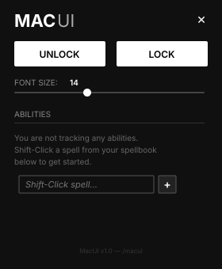
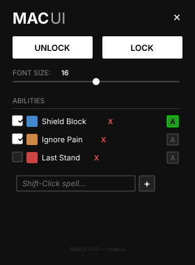
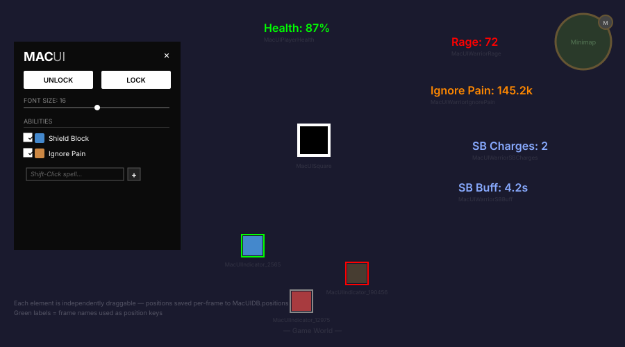
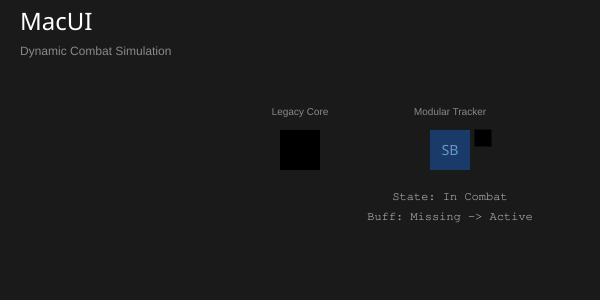

# MacUI

A sleek, lightweight, and highly optimized custom user interface for World of Warcraft (Midnight 12.0.5+ API compliant). Designed for power users who want a brutalist, distraction-free combat tracking system with zero external dependencies.

## Features

### 🎯 Fully Independent Element Positioning
Every single UI element — text readouts, spell icons, and the status square — is its own independent, draggable frame. Place each one anywhere on your screen and lock it. Positions are saved per-frame across sessions.

### 📊 Dynamic Ability Tracker
A modular, user-driven tracking system. Add *any* spell in the game via the Smart Input Box. Each tracked ability becomes its own icon on screen with a built-in state machine:
- 🟢 **Green Border:** Ability/Buff is currently active on you.
- 🔴 **Red Border (Desaturated Icon):** Mitigation missing while in combat!
- ⚪ **Gray Border:** Out of combat / Neutral state.

### 🎨 Brutalist Configuration Menu
Type `/macui` or click the minimap button to open a minimalist, brutalist UI panel:
- **Lock / Unlock Frames:** Unlock to drag any element independently. Lock to save all positions.
- **Font Size Slider:** Scale all text readouts globally.
- **Smart Input Box:** Shift-Click a spell from your spellbook, or type an exact Spell ID.
- **Audio Alarm Dropdown:** Click `[A]` next to any ability to assign a warning sound. If you're in combat and missing that buff, the alarm pulses every 3 seconds.
- **Empty State:** New users see a friendly onboarding message guiding them to add their first ability.

### ⚔️ Class Modules (Independent Text Frames)
Each data element is its own freely positionable frame:

**Warrior (Protection):**
| Frame | Content |
|-------|---------|
| `MacUIWarriorRage` | Current Rage |
| `MacUIWarriorIgnorePain` | Ignore Pain absorb value |
| `MacUIWarriorSBCharges` | Shield Block charges |
| `MacUIWarriorSBBuff` | Shield Block buff timer |

**Paladin (Protection):**
| Frame | Content |
|-------|---------|
| `MacUIPaladinHolyPower` | Holy Power count |
| `MacUIPaladinSotR` | Shield of the Righteous timer |
| `MacUIPaladinConsecration` | Consecration active/inactive |

**All Classes:**
| Frame | Content |
|-------|---------|
| `MacUIPlayerHealth` | Health percentage |

### 🗺️ Minimap Integration
- **AddonCompartment (Modern):** Native 10.0+ dropdown entry — no button needed.
- **Classic Draggable Button:** A legacy minimap icon for users who prefer a visible button. Drag it around the minimap ring.
- **Left-Click:** Toggle config panel. **Right-Click:** Lock/Unlock frames.

### 🔊 Audio Warning System
Event-driven, non-polling audio alerts. Assign sounds per-ability from the config panel. The system only activates its timer loop when at least one tracked ability is red — zero CPU cost otherwise.

---

## Previews

### Empty State (First Launch)

*When no abilities are tracked, a friendly message guides new users to Shift-Click a spell from their spellbook.*

### Active Config (Abilities Added)

*Three abilities tracked: Shield Block (with audio alert enabled), Ignore Pain, and Last Stand. Check/uncheck to toggle tracking. Click `X` to remove.*

### Full Independent Layout

*Every element is independently draggable. Text readouts, ability icons, and the status square can be placed anywhere on screen. Positions persist across sessions via `MacUIDB.positions`.*

### Live Combat Simulation

*The state machine reacting to combat: green when buffed, red+desaturated when missing, gray when out of combat.*

---

## Installation
1. Download or clone this repository.
2. Place the `MacUI` folder inside your `World of Warcraft/_retail_/Interface/AddOns/` directory.
3. Log into the game and ensure the addon is enabled in your character select screen.
4. Type `/macui` in chat or click the minimap button to begin customizing your UI!

## Architecture

```
MacUI/
├── MacUI.lua              # Core event handler, DB init, spec change system
├── Config.lua             # Options panel, Lock/Unlock, font slider, Smart Input
├── AbilityTracker.lua     # Custom spell tracking with independent draggable icons
├── Animations.lua         # Reusable animation functions (PulseRed)
├── Square.lua             # Warrior Shield Block status indicator
├── PlayerHealth.lua       # Player health percentage (independent frame)
├── WarriorTracker.lua     # 4 independent frames: Rage, IP, SB Charges, SB Buff
├── PaladinTracker.lua     # 3 independent frames: Holy Power, SotR, Consecration
├── MinimapButton.lua      # AddonCompartment + legacy draggable minimap button
├── .github/
│   ├── AI_DEVELOPMENT_GUIDELINES.md  # Coding standards & API reference
│   └── copilot-instructions.md       # GitHub Copilot instructions
├── .cursorrules           # Cursor AI instructions
└── AGENTS.md              # Gemini/Antigravity instructions
```

## Key Technical Details
- **Zero Dependencies:** No Ace3, no LibDataBroker, no external libraries.
- **12.0.5 API Compliant:** All `C_Spell`, `C_UnitAuras` APIs use modern table returns.
- **Performance:** All globals upvalued, `OnUpdate` throttled and disabled when inactive, frames pooled.
- **SavedVariables:** `MacUIDB` stores positions, font size, tracked abilities, audio settings, and minimap angle.

## License
See [LICENSE](LICENSE) for details.